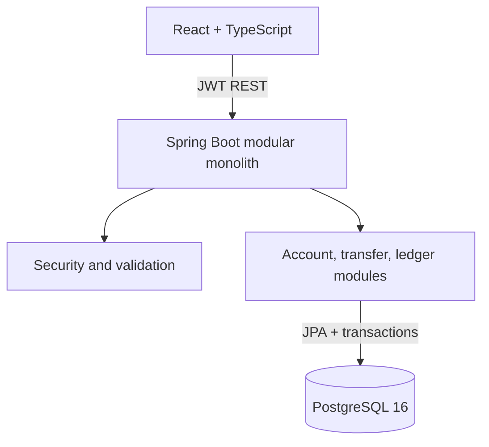

# TallyVault

**Every value accounted for.**

TallyVault is a deliberately small double-entry wallet engine built to explore the parts of payments software that are hard for the right reasons: accounting invariants, atomic database work, concurrent spending, retry safety, immutable history, and reversals.

It is a Spring Boot modular monolith with one PostgreSQL database and a responsive React workspace. The interface uses a purpose-built visual system, live balance reconciliation, accessible transaction proofs, polished loading/error states, and reduced-motion-aware transitions. It is a portfolio project—not a bank, payment processor, PCI-compliant system, or claim of production readiness.

## What it demonstrates

- Every completed money movement has equal debit and credit totals.
- Transfers commit the ledger entries, cached balances, transaction, and idempotency record atomically.
- PostgreSQL pessimistic row locks prevent two requests from spending the same balance.
- Accounts are locked in sorted UUID order to reduce opposite-direction deadlocks.
- An idempotency-key primary key—not a check-then-insert—arbitrates concurrent retries.
- Completed transactions and entries are append-only; corrections use compensating reversals.
- Database triggers independently reject unbalanced completed transactions and ledger mutation.
- User/admin authorization, request DTO validation, pagination, consistent errors, and real PostgreSQL tests round out the API.

## Architecture



The backend is feature-oriented under `com.tallyvault`: `auth`, `account`, `transfer`, `ledger`, and `transaction`, with small `common` and `config` packages. See [docs/ARCHITECTURE.md](docs/ARCHITECTURE.md) and [docs/ER_DIAGRAM.md](docs/ER_DIAGRAM.md).

## Double-entry model

For a ₹500 transfer from Alice to Bob, one `ledger_transaction` owns exactly two entries:

| Account | Entry | Amount | Cached-balance effect |
|---|---:|---:|---:|
| Alice wallet | DEBIT | ₹500.00 | −₹500.00 |
| Bob wallet | CREDIT | ₹500.00 | +₹500.00 |

The application checks this shape and a deferred PostgreSQL constraint trigger enforces `SUM(DEBIT) = SUM(CREDIT)` when the transaction commits as `COMPLETED`. Money uses `BigDecimal`/`NUMERIC(19,2)` with scale 2 and rejects implicit rounding.

## Transfer lifecycle

1. Validate the JSON body and normalize the amount.
2. Hash the business request and insert a transaction plus idempotency claim.
3. Lock both accounts in deterministic UUID order using `PESSIMISTIC_WRITE`.
4. Revalidate ownership, states, currency, and funds after acquiring the locks.
5. append one debit and one credit; update the cached balance projection.
6. Mark the transaction complete and flush. PostgreSQL verifies the balanced invariant at commit.
7. Commit everything, or roll everything back.

A duplicate key and identical request replays the original result (`200 OK`). Reusing the key for different request data returns `409 Conflict`. The primary-key collision serializes concurrent duplicate submissions; there is no vulnerable `exists` followed by `insert` sequence.

## Reversals and immutability

`POST /transactions/{id}/reverse` is admin-only. It locks the original transaction, verifies that no reversal exists, then posts the inverse debit/credit pair in a new `REVERSAL` transaction. A unique constraint on `reversal_of_transaction_id` prevents two reversals. The original remains unchanged. PostgreSQL triggers reject updates/deletes of completed transactions and all updates/deletes of ledger entries.

## Run in about five minutes

Requirements: Docker with Compose v2.

```bash
cp .env.example .env
docker compose up --build
```

Open `http://localhost:3000`. The API and health endpoint are at `http://localhost:8080` and `http://localhost:8080/actuator/health`.

Demo users:

| Role | Email | Password |
|---|---|---|
| User | `alice@tallyvault.dev` | `Alice123!` |
| User | `bob@tallyvault.dev` | `Bob12345!` |
| Admin | `admin@tallyvault.dev` | `Admin123!` |

Alice and Bob receive balanced demo funding entries. Alice can transfer to Bob using destination account `TV-BOB-001`.

## API overview

| Method | Path | Access | Purpose |
|---|---|---|---|
| POST | `/auth/register` | Public | Create a USER and return a JWT |
| POST | `/auth/login` | Public | Authenticate |
| POST | `/accounts` | Authenticated | Create own account |
| GET | `/accounts` | Authenticated | List own accounts |
| GET | `/accounts/{id}/balance` | Owner/admin | Cached and ledger-derived balance |
| GET | `/accounts/{id}/transactions?page=0&size=20` | Owner/admin | Paginated history |
| POST | `/transfers` | Authenticated | Idempotent transfer |
| GET | `/transfers/{id}` | Participant/admin | Transfer details and entries |
| POST | `/transactions/{id}/reverse` | Admin | Append a compensating reversal |
| GET | `/transactions?page=0&size=20` | Admin | System transaction lookup |
| PATCH | `/admin/accounts/{id}/status` | Admin | Freeze/unfreeze an account |

Example transfer:

```bash
curl -i http://localhost:8080/transfers \
  -H "Authorization: Bearer $TOKEN" \
  -H "Idempotency-Key: 550e8400-e29b-41d4-a716-446655440000" \
  -H "Content-Type: application/json" \
  -d '{"sourceAccountId":"SOURCE_UUID","destinationAccountId":"DESTINATION_UUID","amount":500.00,"reference":"Rent share"}'
```

Important status choices: `400` malformed input, `401` missing/invalid authentication, `403` valid user without access, `404` unknown resource, `409` idempotency/reversal conflict, and `422` a syntactically valid transfer that violates a business rule such as insufficient funds.

## Tests

```bash
cd backend
mvn test

cd ../frontend
npm ci
npm run build
```

Backend integration tests use Testcontainers with PostgreSQL 16; Docker must be running. Critical cases cover balanced entries, full rollback, repeated and concurrent idempotency, simultaneous overspending, opposite-direction locking, single reversal, append-only triggers, authentication, and ownership. Unit tests use JUnit 5, AssertJ, and Mockito. CI runs the same backend suite and frontend build.

## Repeatable benchmarks

Start a fresh demo stack, then run one workload at a time and retain the JSON evidence:

```bash
node benchmark/tallyvault-load.mjs --mode throughput --requests 100 --concurrency 10 \
  --output benchmark/results/throughput-100.json
node benchmark/tallyvault-load.mjs --mode idempotency --requests 100 --concurrency 20 \
  --output benchmark/results/idempotency-100.json
node benchmark/tallyvault-load.mjs --mode overspend --requests 2 --concurrency 2 \
  --output benchmark/results/overspend-2.json
```

Run each throughput size (`100`, `1000`, `10000`) at least three times on a freshly reset dataset. Copy only observed values into [docs/BENCHMARK_RESULTS.md](docs/BENCHMARK_RESULTS.md). No performance number is claimed in this repository before that evidence exists.

## Known limitations

- One currency per transfer; no FX, fees, holds, scheduled payments, or external settlement.
- JWT access tokens have no refresh/revocation workflow.
- The cached balance is reconciled on the read endpoint but there is no scheduled repair job.
- No rate limiting, MFA, account closing workflow, regulatory audit/compliance system, or key-management service.
- Idempotency records do not yet expire; a real retention policy needs product requirements.
- Reversal requires the receiver to have enough balance and deliberately supports only two-leg transfers.
- Load-test results depend on the runner and are intentionally absent until executed and recorded.

These constraints keep the project understandable and defensible for an SDE-1 discussion. Suggested next steps are a reconciliation command, refresh-token rotation, admin-action audit records, and measured query/index tuning—not microservices.

## Project evidence

- [Reference repository analysis](REPO_ANALYSIS.md)
- [Architecture and decisions](docs/ARCHITECTURE.md)
- [Database/ER model](docs/ER_DIAGRAM.md)
- [Interview guide](docs/INTERVIEW_GUIDE.md)
- [Benchmark record](docs/BENCHMARK_RESULTS.md)
- [Evidence-safe resume bullets](docs/RESUME_BULLETS.md)
- [Final SDE-1 audit](SDE1_AUDIT.md)

## Attribution and independence

TallyVault was designed independently after studying the public repositories listed in `REPO_ANALYSIS.md`. Their domain ideas informed the analysis; their modules were not renamed or reproduced. Preserve each upstream repository's own license when using its code. This repository contains no copied upstream module and makes no claim that the reference work was authored here.
