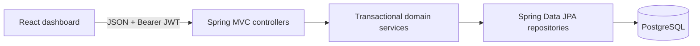

# Architecture

## Scope and quality target

TallyVault is a learning-oriented wallet ledger, not a distributed banking platform. It uses one deployable backend and one relational database so that its hardest behavior—transaction correctness under concurrency—can be followed in a debugger and defended in an SDE-1 interview.



There are no microservices, broker, cache, gateway, distributed transaction, secondary database, or telemetry stack. Docker Compose is a run convenience, not an orchestration architecture.

## Backend modules

| Package | Responsibility | Important classes |
|---|---|---|
| `auth` | Registration/login, BCrypt credentials, JWT verification, current principal | `AuthService`, `JwtService`, `JwtAuthenticationFilter`, `CurrentUser` |
| `account` | Account lifecycle, ownership, cached/derived balance, admin state | `Account`, `AccountService`, `AccountController`, `AdminAccountController` |
| `transfer` | Idempotent request orchestration, deterministic locks, posting | `TransferService`, `TransferCreationService`, `IdempotencyReplayService`, `AccountLockService` |
| `ledger` | Immutable debit/credit entries and two-legged posting | `LedgerEntry`, `LedgerPostingService` |
| `transaction` | Transaction aggregate, query authorization, reversals | `LedgerTransaction`, `TransactionQueryService`, `ReversalService` |
| `common` | Money policy, errors and page DTO | `Money`, `ApiExceptionHandler`, `PageResponse` |
| `config` | Security/CORS and deterministic demo seed | `SecurityConfig`, `DemoDataService` |

Controllers accept/return DTOs; entities are not serialized directly. Service methods own business decisions, repositories own persistence queries, and the migration owns database invariants.

## Transaction lifecycle and boundary

```mermaid
sequenceDiagram
    participant C as Client
    participant S as Transfer service
    participant D as PostgreSQL
    C->>S: POST /transfers + key
    S->>D: INSERT transaction + idempotency claim
    S->>D: Lock both accounts in UUID order
    S->>S: Validate states, funds, ownership
    S->>D: INSERT debit + credit; update balances
    S->>D: Mark COMPLETED
    D-->>D: Deferred balance trigger
    D-->>S: Commit all or roll back all
    S-->>C: 201 new / 200 replay
```

`TransferCreationService.create` is `@Transactional`. No external call happens inside the transaction. Entries and cached balances are managed objects in the same persistence context. `saveAndFlush` makes the idempotency and completion constraints visible before the method returns; the actual commit remains atomic.

### Money policy

- Java: `BigDecimal`, scale 2, `RoundingMode.UNNECESSARY`.
- PostgreSQL: `NUMERIC(19,2)` and `CHECK (amount > 0)`.
- API DTO: at most 17 integer digits and 2 fractional digits, minimum `0.01`.
- Currency is an ISO-like three-character account field. A transfer requires exact currency equality; FX is out of scope.

## Concurrency decision

Primary strategy: pessimistic PostgreSQL row locking through JPA `PESSIMISTIC_WRITE` (`SELECT ... FOR UPDATE`).

Why it fits:

- The available balance is a shared row that must be checked and changed together.
- Contention is expected to be localized per account.
- The algorithm has no retry loop or version-conflict policy to hide from a fresher.
- PostgreSQL releases locks automatically at commit/rollback.

The service sorts both account UUIDs before locking. Without that rule, `A → B` could hold A and wait for B while `B → A` holds B and waits for A. Ordering makes both wait for the same first row. It reduces application-created deadlocks; the database may still detect unrelated deadlocks, so callers should treat transient database failures as retryable with a new transport attempt and the same idempotency key.

Validation of funds occurs after both rows are locked. In the two-₹800 race against ₹1,000, the second request sees the first committed balance and is rejected with `422`; it cannot use the stale ₹1,000 value.

Alternative considered: an optimistic `@Version` column. This can be effective at low contention, but it needs bounded retries and careful idempotency behavior. The pessimistic approach is more direct for this portfolio.

## Idempotency decision

The key is the primary key of `idempotency_records`. The record also stores a SHA-256 hash over source, destination, normalized amount, and reference, plus a unique transaction link.

Why not `if (!exists(key)) insert`:

1. Request A checks and sees no row.
2. Request B checks and sees no row.
3. Both create a transfer.

Instead, both attempt `INSERT`. PostgreSQL permits only one key. The losing transaction rolls back and a new read-only transaction retrieves the committed winner. Same key/same hash returns the first result; same key/different hash is a `409` misuse. This works across application threads and would still work across multiple instances, although TallyVault intentionally deploys one backend.

## Ledger and balance decision

`ledger_entries` are the durable accounting evidence. `accounts.cached_balance` is a transactionally updated projection used for locking and fast display. `GET /accounts/{id}/balance` calculates the ledger-derived balance and reports whether the cache is `reconciled`.

Defense in depth:

| Layer | Rule |
|---|---|
| DTO | Positive value, two decimal places, required account IDs |
| Service | Different accounts, ownership, ACTIVE states, currency match, sufficient funds |
| Database row lock | Serializes balance check/change per account |
| DB constraints | Valid enums, positive entries, unique identities, nonnegative customer balance |
| Deferred DB trigger | Completed transaction has at least two entries and equal debit/credit totals |
| Immutability triggers | No entry update/delete; no mutation of a completed transaction; no late entry |
| Tests | Direct SQL attacks and concurrent requests verify the defenses |

PostgreSQL cannot express cross-row debit equality as a normal `CHECK`, so the migration uses a deferrable constraint trigger. It runs at transaction end, after both entries have been inserted.

## Reversal decision

A reversal is a new transaction linked through `reversal_of_transaction_id`:

- lock original transaction;
- accept only a completed two-leg `TRANSFER`;
- require no existing reversal;
- lock the two accounts in the normal order;
- post the original credit as the reversal debit and original debit as the reversal credit;
- mark the new transaction complete.

The unique link protects against races even if application checks fail. Frozen accounts may participate in an explicit admin reversal; closed accounts may not. This is a deliberate policy choice documented in code. The receiver must have enough balance, preventing a reversal from silently creating an overdraft.

## Security model

- Passwords: BCrypt; never returned.
- Authentication: signed HMAC JWT bearer token with configurable secret and expiry.
- Roles: `USER` and `ADMIN` only.
- Users may view own accounts/history and initiate from an owned source account.
- Admins may list transactions/accounts, change ACTIVE/FROZEN state, and reverse transfers.
- Object ownership is enforced in services in addition to route authentication.
- CORS is an explicit comma-separated allow-list.

JWT is chosen for a self-contained demo UI. Missing capabilities include refresh rotation, revocation, MFA, rate limiting, managed secrets, and security event auditing; therefore there is no “bank-grade” claim.

## API error policy

| Status | Meaning in TallyVault | Example |
|---:|---|---|
| 400 | Malformed or invalid representation | missing idempotency header, too many decimals |
| 401 | No valid authentication | expired/invalid token |
| 403 | Authenticated but not authorized | reading another user's account |
| 404 | Resource identity does not exist | destination UUID not found |
| 409 | Current state conflicts with request identity | key reused with another payload, already reversed |
| 422 | Valid representation violates domain rules | insufficient funds, frozen account, currency mismatch |

Errors use one centralized JSON shape. Unexpected database or server failures return a generic response; implementation details are not exposed.

## Frontend

The Vite/React/TypeScript client uses a small API wrapper and browser-local JWT session. Screens include login, account overview, transfer form with destination lookup, paginated history, visual transaction debit/credit details, and admin controls. Tailwind provides presentation; no frontend state framework is needed for this scope.

## Deployment and operations

Compose starts PostgreSQL 16, a multi-stage-built Spring Boot container, and an Nginx-served frontend. Flyway applies the schema at API startup and Actuator exposes health. Demo data is controlled by an environment flag. GitHub Actions builds the frontend and runs all backend tests with Testcontainers.

## Failure cases and behavior

| Failure | Outcome |
|---|---|
| Destination does not exist after idempotency claim | Entire transaction and claim roll back |
| Two overspending requests | Lock serializes; one may commit, later request revalidates and fails |
| Two identical keys | One insert wins; all successful responses identify one transaction |
| Same key, different body | No new transfer; `409` |
| Exception between debit and credit/completion | Local transaction rolls back entries and balances |
| Unbalanced direct SQL completion | Deferred trigger aborts commit |
| Entry update/delete | Append-only trigger rejects statement |
| Two reversal requests | Original-row lock and unique link allow one reversal |

## Future improvements, in order

1. Add a CLI/admin reconciliation report with alerting and a documented repair procedure.
2. Add refresh-token rotation/revocation and audit records for admin actions.
3. Run and record benchmark suites; tune only observed bottlenecks with `EXPLAIN ANALYZE` evidence.
4. Define idempotency retention and cleanup behavior.
5. Add a formal account-closing workflow.

Microservices, brokers, distributed tracing, and Kubernetes are not “next steps” until an actual independent component or operational constraint requires them.
